# Professor Profiler 🎓

[](https://www.python.org/)
[](https://ai.google.dev/)
[](https://github.com/uffamit/Professor_Profiler)
[](LICENSE)
[](https://github.com/uffamit/Professor_Profiler/actions/workflows/quality-assurance.yml)
[](https://github.com/uffamit/Professor_Profiler)

> **An advanced multi-agent system that reverse-engineers exam papers to decode professor psychology and generate optimized study strategies.**

---

## 📖 Overview

**Professor Profiler** is not just a document reader; it is a **Hierarchical Multi-Agent System (HMAS)** designed to mimic the cognitive process of an expert tutor. By orchestrating specialized AI agents powered by **Google Gemini 2.5**, it ingests raw exam PDFs, breaks them down into cognitive components (Bloom's Taxonomy), identifies statistical patterns, and formulates actionable "Safe Zone" and "Hit List" study plans.

This project serves as a reference implementation for:
*   **Hub-and-Spoke Agent Architecture**
*   **Model Context Protocol (MCP) Tooling**
*   **Long-term Memory Management (RAG-lite)**
*   **Production-grade Observability (Tracing & Metrics)**

---

## 🏗️ System Architecture

The system creates a directed acyclic graph (DAG) of agent execution, managed by a central orchestrator.

### High-Level Design

```mermaid
flowchart TD
    subgraph External_Layer ["🔌 External Layer"]
        User([User / Client])
        PDF_File[Exam PDF]
    end

    subgraph Orchestration_Layer ["🧠 Orchestration Layer"]
        Runner[<b>Runner</b><br><i>State Management</i>]
        Memory[(<b>Memory Bank</b><br><i>JSON Persistence</i>)]
        Session[<b>Session Service</b>]
    end

    subgraph Agent_Layer ["🤖 Agent Hierarchy"]
        Root[<b>ROOT AGENT</b><br><i>Gemini 2.5 Pro</i><br>The Project Manager]
        
        subgraph Workers ["Specialized Sub-Agents"]
            Taxonomist[<b>Taxonomist</b><br><i>Gemini Flash</i><br>Topic & Bloom's Classification]
            Trend[<b>Trend Spotter</b><br><i>Gemini Pro</i><br>Statistical Analysis]
            Strat[<b>Strategist</b><br><i>Gemini Thinking</i><br>Study Planning]
        end
    end

    subgraph Tool_Layer ["🛠️ Tool Layer"]
        Reader[PDF Ingestion]
        Plotter[Matplotlib Viz]
        Calc[Stats Engine]
    end

    User --> Runner
    PDF_File --> Reader
    Runner <--> Session
    Runner <--> Memory
    Runner --> Root
    
    Root --Delegates--> Taxonomist
    Root --Delegates--> Trend
    Root --Delegates--> Strat
    
    Root --Calls--> Reader
    Root --Calls--> Plotter
    Trend --Calls--> Calc
```



### Execution Pipeline

The following sequence illustrates how a raw PDF is transformed into a study plan.


---

## 🛠️ Tech Stack

| Component | Technology | Description |
| :--- | :--- | :--- |
| **Core Logic** | Python 3.10+ | Type-hinted, async-native codebase. |
| **LLM Engine** | Google Gemini 2.5 | Uses `Pro` for reasoning and `Flash` for high-speed tasks. |
| **Orchestrator** | Google ADK (Custom) | Custom implementation of the Agent Development Kit patterns. |
| **Document Processing** | `pypdf` | Robust text extraction from standardized exam papers. |
| **Visualization** | `matplotlib` | Generates distribution bar charts and pie charts on the fly. |
| **Observability** | `logging` + `uuid` | Distributed tracing with correlation IDs for debugging. |
| **Configuration** | `pydantic` | Environment variable validation and typed configuration. |

---

## 🤖 Agent Personas

The system is composed of three distinct "personalities" to ensure high-quality output:

### 1. The Taxonomist (Classifier)
*   **Model:** `gemini-2.0-flash-exp` (Optimized for speed/cost)
*   **Role:** The meticulous grader. It reads every question and tags it with:
    *   **Topic:** (e.g., "Thermodynamics", "Linear Algebra")
    *   **Bloom's Level:** (Remember, Understand, Apply, Analyze, Evaluate, Create)
    *   **Marks:** The weight of the question.

### 2. The Trend Spotter (Analyst)
*   **Model:** `gemini-2.0-pro-exp` (Optimized for context window)
*   **Role:** The data scientist. It looks at the classified data to find:
    *   Topic frequency distribution.
    *   Difficulty spikes compared to previous years.
    *   "Curveball" questions that deviate from the norm.

### 3. The Strategist (Coach)
*   **Model:** `gemini-2.0-flash-thinking-exp-01-21` (Reasoning enabled)
*   **Role:** The academic coach. It takes the analysis and outputs:
    *   **✅ Safe Zone:** Topics you must master (High reward, Low effort).
    *   **⚠️ Danger Zone:** Topics that are high difficulty and appear frequently.
    *   **🗑️ Drop List:** Low-value topics you can safely skip if short on time.

---
### Inter-Agent Communication Flow

This diagram illustrates the data hand-offs. Notice how the **Root Agent** aggregates the outputs from one agent before passing them as context to the next.


---

## 🚀 Getting Started

### Prerequisites
1.  **Python 3.10** or higher installed.
2.  A **Google Cloud Project** or **AI Studio** account.
3.  An API Key from [Google AI Studio](https://aistudio.google.com/).

### Installation

```bash
# 1. Clone the repository
git clone https://github.com/uffamit/Professor_Profiler.git
cd Professor_Profiler

# 2. Create a virtual environment (Recommended)
python -m venv .venv
source .venv/bin/activate  # On Windows: .venv\Scripts\activate

# 3. Install dependencies
pip install -r requirements.txt
```

### Configuration

Create a `.env` file or export variables in your shell:

```bash
# Required: Your Gemini API Key
export GOOGLE_API_KEY="AIzaSy..."

# Optional: Switch to Vertex AI (Enterprise)
# export GOOGLE_GENAI_USE_VERTEXAI="True"
# export GOOGLE_CLOUD_PROJECT="my-gcp-project"
# export GOOGLE_CLOUD_LOCATION="us-central1"
```

---

## 💻 Usage

### 1. The Input/Output Workflow
The system relies on a file-system interface for processing documents.

1.  **Drop PDF:** Place `Finals_2024.pdf` into the `input/` folder.
2.  **Run Agent:** Execute the script.
3.  **Get Result:** Check `output/reports/` for the text and `output/charts/` for images.

### 2. Running the Demo
The `demo.py` script runs a full simulation of the pipeline.

```bash
python demo.py
```

### 3. Custom Implementation
Here is how to invoke the agent programmatically in your own application:

```python
import asyncio
from google.genai import types
from profiler_agent.agent import root_agent
from google.adk.runners import Runner
from google.adk.sessions import InMemorySessionService

async def main():
    # Initialize memory
    session = InMemorySessionService()
    
    # Initialize runner
    runner = Runner(agent=root_agent, session_service=session)
    
    # Define the user task
    user_msg = "Analyze the chemistry_midterm.pdf file in the input folder."
    
    # Execute
    print("🤖 Agent is thinking...")
    async for event in runner.run_async(
        user_id="prof_user",
        session_id="sess_01",
        new_message=types.Content(role="user", parts=[types.Part.from_text(user_msg)])
    ):
        if event.is_final_response():
            print(f"\n🎓 Final Answer:\n{event.content.parts[0].text}")

if __name__ == "__main__":
    asyncio.run(main())
```

---

## 📂 Project Structure

```text
Professor_Profiler/
├── input/                     # 📥 Place PDFs here for analysis
├── output/                    # 📤 Generated artifacts
│   ├── charts/                #    - Topic distribution graphs
│   ├── logs/                  #    - Structured JSON logs
│   └── reports/               #    - Markdown study guides
├── google/adk/                # 🧱 ADK Framework Core
│   ├── agents/                #    - Base Agent classes
│   ├── runners/               #    - Execution logic
│   └── tools/                 #    - Tool wrapping logic
├── profiler_agent/            # 🧠 Application Logic
│   ├── sub_agents/            #    - Taxonomist, Trend, Strategist
│   ├── tools.py               #    - PDF & Math tools
│   ├── config.py              #    - Model & Env settings
│   └── observability.py       #    - Tracing implementation
└── tests/                     # 🧪 Pytest suite
```

---

## ❓ Troubleshooting

| Issue | Cause | Solution |
| :--- | :--- | :--- |
| `403 Permission Denied` | Invalid API Key | Check `GOOGLE_API_KEY` in your environment variables. |
| `FileNotFoundError` | PDF missing | Ensure your PDF is exactly in the `input/` folder and the filename matches your query. |
| `ResourceExhausted` | API Quota hit | The `Thinking` model uses many tokens. Switch to `flash` in `config.py` for testing. |
| `Empty Chart` | Matplotlib error | Ensure the agent found data. Check `output/logs/` for parsing errors. |

---

## 📜 License

Distributed under the MIT License. See [LICENSE](LICENSE) for more information.

---

**Maintained by [uffamit](https://github.com/uffamit)** 
